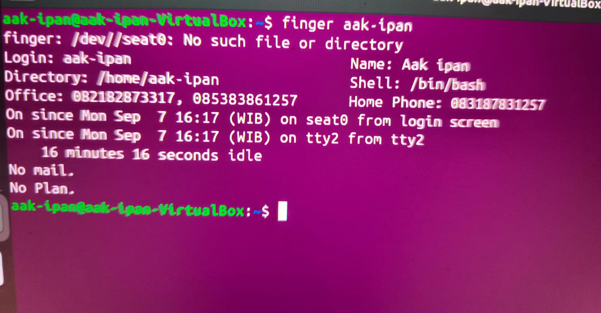
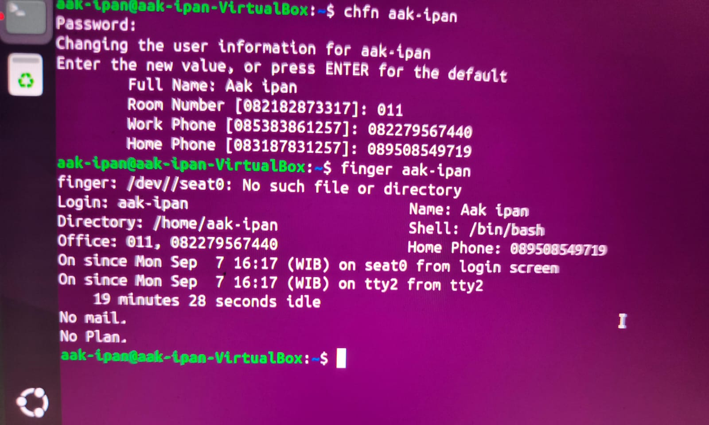
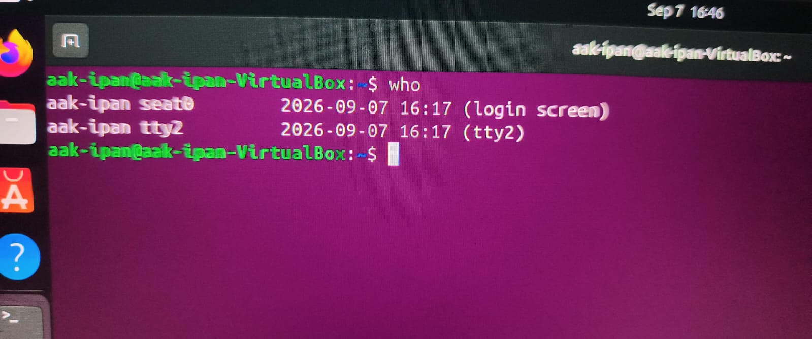
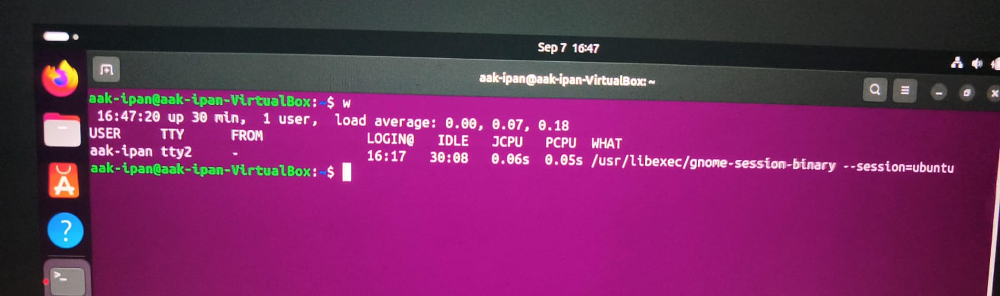
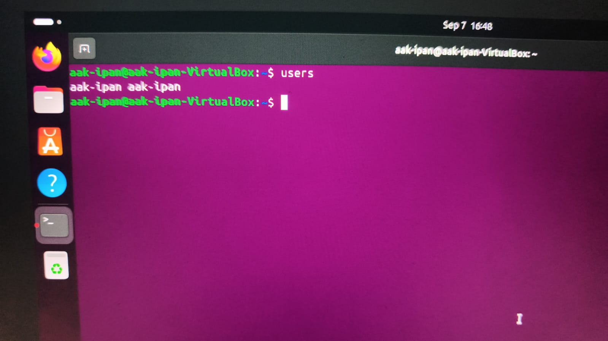
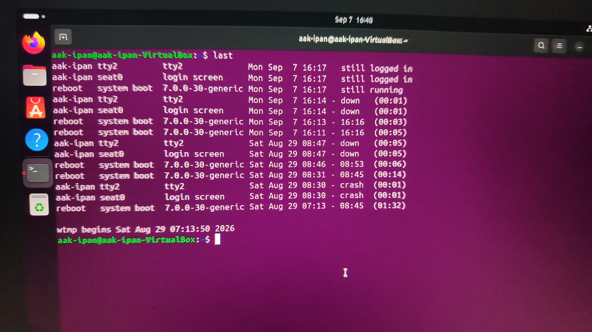
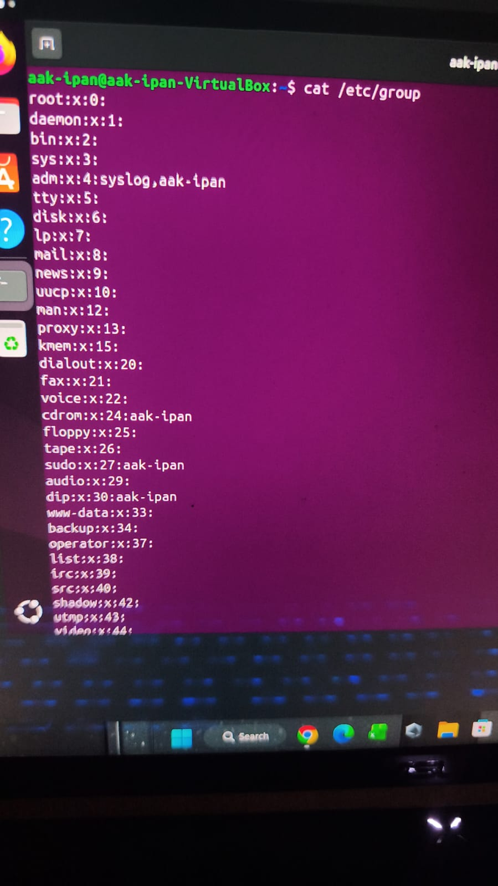
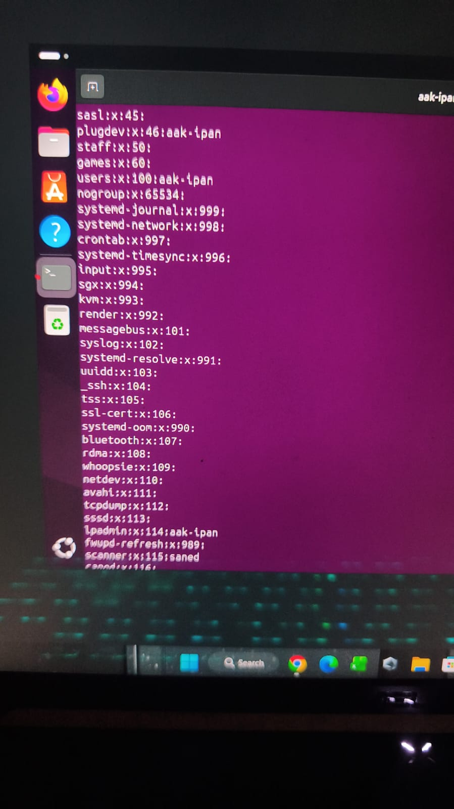
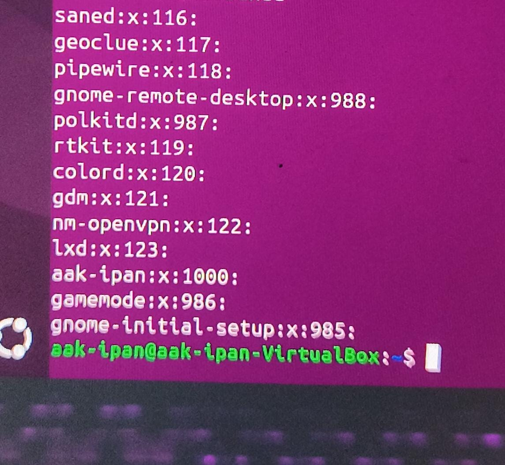
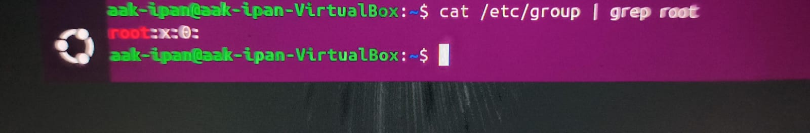

# 09011382530143_M.Irpan_Tugas-4-Sistem-operasi-
Nama	: M. Irpan

Nim	:09011382530143

Matkul	: Sistem operasi

Tugas 2

1. Tugas Percobaan 1 Informasi finger Ubahlah informasi finger pada komputer Anda.?
   
Jawab

1.Sebelum 

 
 
2.Sesudah 

  
  
2. Tugas Percobaan 2 log user aktif Lihatlah user-user yang sedang aktif pada komputer Anda. 
Jawab

a. Perintah who

1.	Menampilkan daftar user yang sedang login beserta terminal dan waktu login:
Who

  
  
b. Perintah w

1.	Menampilkan user aktif lebih detail, termasuk proses yang sedang dijalankan tiap user:
W:

  
  
c. Perintah users

1.	Menampilkan hanya nama-nama user yang sedang login (ringkas):
Users:

 
 
d. Perintah last (opsional, riwayat login)

1.	Menampilkan riwayat login user sebelumnya, bukan hanya yang aktif sekarang:
Last:

 

3. Tugas Percobaan 3 group Buka  file $cat /etc/group kemudian analisa untuk root:x:0
Jawab

1.	Jalankan perintah berikut di terminal:
cat /etc/group
 
  
   
    
 

2.	Untuk mencari baris root secara spesifik, gunakan grep:
   
cat /etc/group | grep root

 

 3 Analisa baris root:x:0
 
Setiap baris pada file /etc/group memiliki format: nama_group:password:GID:daftar_anggota. Baris root:x:0 dapat dianalisa sebagai berikut:

A.	root — nama group, yaitu group bernama "root" yang merupakan group utama pemilik hak akses tertinggi (superuser) di sistem Linux.
	
B.	x — menandakan password group disimpan secara terenkripsi di file /etc/gshadow, bukan langsung di /etc/group (untuk alasan keamanan).
	
C.	0— GID (Group ID), yaitu angka identitas group. Angka 0 selalu dipakai oleh group root karena merupakan group pertama/default sistem dengan hak akses penuh.

D.	Bagian setelah GID (kosong pada baris root) — daftar anggota tambahan group, yaitu user lain di luar user root yang ditambahkan sebagai anggota group root. Karena kosong, artinya tidak ada user tambahan pada group root.

